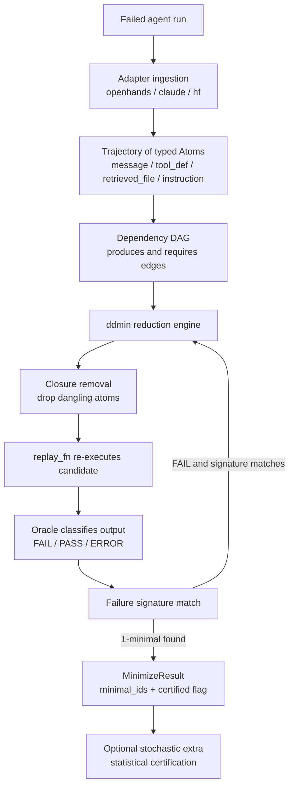

# tracemin

**Re-execution-verified, dependency-aware delta-debugging for failed LLM-agent runs.**

Given a failed agent run and a `replay_fn`, `tracemin` shrinks the trajectory's
context — messages, tool definitions, retrieved files, instructions — to a
**1-minimal** subset by *re-executing each candidate* and keeping only those that
still reproduce the **same** failure (matched by a normalized failure signature).

`tracemin` returns a **minimal reproducer** — the smallest context that still
triggers the failure — not an explanation of the underlying cause.

> **Status:** pre-alpha (`0.1.0a1`). API and outputs may change.

## Architecture



## What it does (and does not) claim

**Does:**
- Returns a context subset whose failure is **re-verified by re-execution** (not by a static heuristic).
- Keeps every candidate **well-formed by construction** via dependency-aware closure removal.
- With the `[stochastic]` extra, treats a stochastic policy honestly: an atom is
  reported as necessary only when a statistical interval-separation test passes.
- Targets the **same** failure as the original run via a normalized failure signature.

**Does not:**
- Attribute the failure to a step or describe the underlying mechanism (that is failure attribution, a different problem).
- Promise a unique answer under a non-reproducible (flaky) `replay_fn`.
- Work with arbitrary agent frameworks without an adapter — see the adapter table.

The single-shot core reports `certified: false`. Certification is available only
through the `[stochastic]` extra and only when interval separation passes.

## Install

```bash
pip install tracemin                 # core (re-execution engine + adapters)
pip install "tracemin[stochastic]"   # + statistical certification (numpy/scipy)
pip install "tracemin[all]"          # + seedloop / context-sieve integrations
```

> Core and `[stochastic]` support Python >= 3.10. The `[sieve]` and `[all]`
> extras pull `context-sieve` (a git dependency) which requires Python >= 3.11.

## Quickstart (bring your own `replay_fn`)

```python
from tracemin import Atom, AtomKind, ExitCodeOracle, RawOutput, Trajectory, minimize

# 1. Normalize the failed run into typed atoms.
atoms = [
    Atom.make(AtomKind.INSTRUCTION, "You are a helpful agent.", order=0),
    Atom.make(AtomKind.MESSAGE, {"role": "user", "content": "do the task"}, order=1),
    # ... the rest of the messages / tool defs / retrieved files ...
]
traj = Trajectory.of(atoms)

# 2. Re-execute a candidate subset and return its raw output.
def replay_fn(subset):
    result = run_your_agent(subset)          # your code
    return RawOutput(exit_code=result.code, text=result.text)

# 3. Shrink to a 1-minimal reproducer of the SAME failure.
result = minimize(traj, replay_fn, ExitCodeOracle())
print(result.minimal_ids)                    # the minimal context
print(result.certified)                      # False (single-shot core)
```

No replay function to write? The `hf` adapter re-prompts a HuggingFace endpoint at
temperature 0 as the replay engine:

```python
from tracemin import RegexOracle, minimize
from tracemin.adapters.hf import HFReplay   # set HF_TOKEN in the environment

result = minimize(traj, HFReplay("meta-llama/Llama-3.1-8B-Instruct"), RegexOracle("KeyError"))
```

## CLI

```bash
tracemin doctor                              # report LIVE / MOCK / MISSING per component
tracemin reduce run.json --adapter openhands --model <hf-id> --oracle exception:KeyError
tracemin replay repro.json                   # validate + summarize a saved artifact
tracemin diff a.json b.json                  # compare two artifacts' minimal atoms
```

Oracle specs: `exit-nonzero`, `regex:PAT`, `not-regex:PAT`, `exception:TYPE`, `answer:TEXT`.

## Adapters

| Adapter | Role | Replay |
|---|---|---|
| `hf` | stateless re-prompt at temperature 0 | replay-capable (the default engine) |
| `openhands` | ingest V0 `trajectory.json` / V1 `events/` | replay via the `hf` engine |
| `claude` | ingest Claude Code JSONL transcripts | reduction-only (attach an engine to verify) |

## How it works

1. The run is normalized into content-addressed **atoms** with `produces`/`requires`
   edges that induce a dependency DAG.
2. A dependency-aware **ddmin** searches for a 1-minimal failing subset. When it
   proposes removing a set, **closure removal** also drops anything left dangling, so
   every tested candidate satisfies the well-formedness invariant — hence the reported
   minimality is **wf-constrained** 1-minimal.
3. A candidate is accepted only when the oracle returns `FAIL` **and** its normalized
   failure signature equals the original's. Transport/infrastructure errors map to a
   third verdict (`ERROR`) that is excluded from both accept and reject.
4. The single-shot core never certifies. The `[stochastic]` extra re-runs each
   leave-one-out *k* times and certifies an atom only on interval separation.

## Honesty guards in the engine

- **Three-valued verdicts.** Transport/infrastructure `ERROR` is never collapsed to `PASS`; persistent errors make the removal inconclusive rather than accepted.
- **Pre-flight sanity.** The full input must reproduce the failure first; if it does not, `minimize` aborts rather than running on a non-reproducible baseline.
- **Flakiness double-check.** With `double_check` (default on), an interesting result must reproduce twice consecutively — a cheap guard, not a statistical claim.
- **Single-shot core is never certified.** Statistical certification lives only in the `[stochastic]` extra.

## Benchmarks

All figures are `[synthetic-benchmark]` results from a failure-injection suite whose
ground truth is known by construction. Highlights (seed 0): recovery recall `1.0`
`[synthetic-benchmark]`, wf-constrained 1-minimality verified at `1.0`
`[synthetic-benchmark]`, and the false-reproducer rate dropping from `0.45`
`[synthetic-benchmark]` without the failure signature to `0.0` `[synthetic-benchmark]`
with it. See [BENCHMARK.md](BENCHMARK.md) and
[`results/v0.1.0a1_bench.json`](results/v0.1.0a1_bench.json).

> This is a synthetic benchmark demonstrating that the algorithm recovers a known
> injected ground truth; it is not a prediction of real-world performance.

## Related work

Delta debugging is Zeller & Hildebrandt's ddmin (TSE 2002). Recent work applies it to
prompts (Amazon, "Delta Debugging for LLM-Integrated Systems", ICSE 2026 SEIP — no
released tool) and compresses *code* context to *succeed* (OCD/SWEZZE, arXiv 2603.28119
— the opposite objective). Failure *attribution* (AgenTracer, Who&When) answers a
different question. `tracemin` whole-trajectory atoms, re-execution verification and a
distributed OSS package occupy a niche we are not aware of being filled by an existing
tool.

## License

MIT. See [LICENSE](LICENSE).
